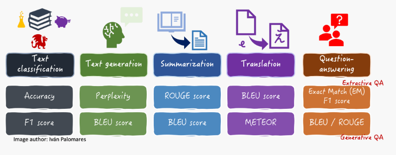

<h1 align="center">
  
   
  <!-- Estudo de Caso -->
</h1>

<!--  -->

# Índice
[Métricas](#metricas) 
[01.01 - Introdução Parte 1](#1.1) 
[01.02 - Introdução Parte 2](#1.2) 
[02 - Limpando os Dados](#2) 
[03 - Classificação Multi Label](#3) 
[04 - Corretor Ortográfico](#4) 

***

## Métricas

    <a href="#topo">Voltar ao topo</a>

<h1 align="center">
  
   
</h1>

### Acurácis (Accuracy)
Mede a correção geral das previsões (normalmente classificações) calculando a porcentagem de previsões corretas do total de previsões.1

### F1 Score
Fornece uma abordagem mais sutil, especialmente para avaliar previsões categóricas em face de conjuntos de dados desequilibrados, combinando precisão e recuperação

### Perplexity
Mede o quão bem um LLM prevê um texto gerado por amostra, observando cada probabilidade de palavra gerada de ser a escolhida como a próxima na sequência. Em outras palavras, essa métrica quantifica a incerteza de modelotes.

### ROUGE, BLEU e METEOR
BLEU ROUGE, e METEORO são particularmente utilizados em tarefas de tradução e sumarização, onde tanto a compreensão da linguagem quanto os esforços de geração de linguagem são igualmente necessários: eles avaliam a semelhança entre textos gerados e de referência (por exemplo, fornecidos por anotadores humanos). O BLEU se concentra na precisão contando n-gramas correspondentes, sendo usado principalmente para avaliar traduções, enquanto o ROUGE mede o recall examinando unidades de linguagem sobrepostas, muitas vezes usadas para avaliar resumos. O METEOR adiciona sofisticação considerando aspectos adicionais, como sinônimos, hastes de palavras e muito mais.

### Exact Match
Uma métrica bastante direta, mas drástica, de comportamento correspondência exata (EM) é utilizado em casos de utilização de respostas a perguntas extrativas para verificar se uma resposta gerada por modelotes corresponde completamente a uma resposta de referência “gold standard”. É frequentemente usado em conjunto com a pontuação F1 para avaliar essas tarefas.

## 01.01 - Introdução Parte 1

    <a href="#topo">Voltar ao topo</a>

* Bag of Words
* Matriz Esparsa
* Word Cloud
* Tokenize
* Stop Words

## 01.02 - Introdução Parte 2

    <a href="#topo">Voltar ao topo</a>

* Pré processamento
* Stemmer
* TF-IDF- Vetorizar 
* Ngram

## 02 - Limpando os Dados

    <a href="#topo">Voltar ao topo</a>

* Regex
* Padding

* Modelo
* NLTK MLE

## 03 - Classificação Multi Label

    <a href="#topo">Voltar ao topo</a>

* One Vs Rest Classifier
* Distância Hamming
* Classifier Chain
* MLkNN

## 04 - Corretor Ortográfico

    <a href="#topo">Voltar ao topo</a>

* Token
* Correção de Palavra

## 05 - Word Embedding

    <a href="#topo">Voltar ao topo</a>

Tratamento de palavras raras e números na frase.

* Token
* Vetor de Palavras
* Classificação

***

    <a href="#topo">Voltar ao topo</a>

