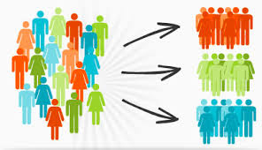

<h1 align="center">
  
   
  Clusterização
</h1>

<!--  -->

Estudo de algoritimos de clustering.

[01 - Classificação](#1) 
[02 - Segmentação de Cliente](#2) 

## 01 - Sistema de Recomendação Musical 

    <a href="#topo">Voltar ao topo</a>

Sistema de recomendação musical utilizando músicas a partir do ano 2000.

* Análise 
  * Plotly
    * Correlação

* Pré Processamento
  * PCA 
  * SdandardScaler

* Modelo
  * K-Means

## 02 - Segmentação de Cliente

    <a href="#topo">Voltar ao topo</a>

Segmentando os cliente utilizando Kmeans.

* Análise 
  * Seaborn
    * Bar Plot com percentual
    * Scatter Plot

* Modelo
  * Regra do Cotovelo
  * K-Means
  * Número ótimo de cluster

***

    <a href="#topo">Voltar ao topo</a>

