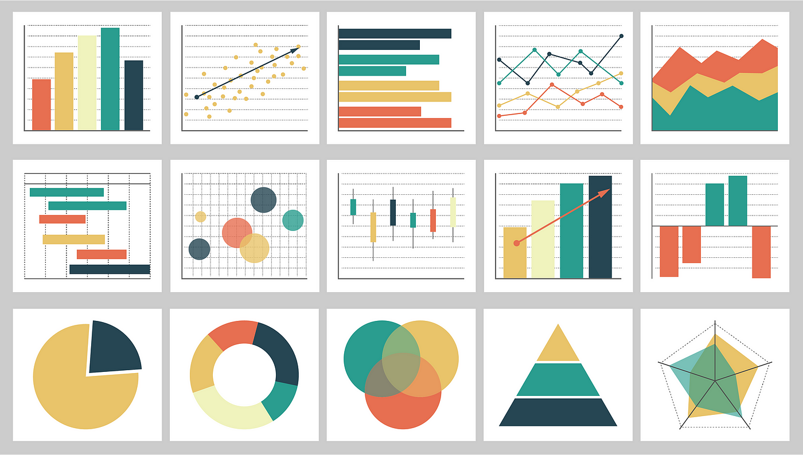

<h1 align="center">
  
   
  <!-- Estudo de Caso -->
</h1>

<!--  -->

[01 - Classificação](#1) 

## 01 - Classificação

    <a href="#topo">Voltar ao topo</a>

- Gráfico de linha
  - Série Temporal

***

    <a href="#topo">Voltar ao topo</a>

