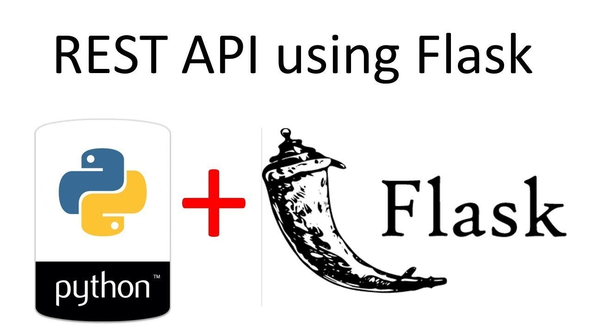

<a id="topo"></a>
<h1 align="center">
  
  <br>
  Flask
</h1>

<div align="center">

<!-- []() -->
[]()


</div>

Colocando um modelo de Machine Learning em produção utilizando uma chama de api com Flask. <br>
Uma requisar é enviada para o serviço onde está executando o modelo, a predição é feita e rentorna o resultado.

## Previsão do preça de uma casa
Envia um POST com o json para `http://127.0.0.1/5000/predicao` no seguinte formato:

  ```
  {
    "tamanho":120,
    "ano":2001,
    "garagem":2
  }
  ```
Código `chamada-api.ipynb` contem o exemplo de chamda de api para previsão do preço da casa utilizanod python.


## Ambiente Virtual

Garantindo as versão das bibliotecas para evitar problemas.
* Criando ambiente
  ```
  python3.9 -m venv venv
  ```
* Ativando o ambiente
  ```
  source venv/bin/activate
  ```
* Agora instale as bibliotecas.