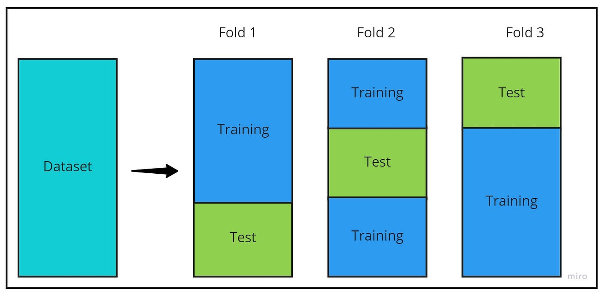

<h1 align="center">
  
   
  <!-- Estudo de Caso -->
</h1>

<!--  -->

# Índice

[01 - Cross Validation](#1) 
[02 - GridSearch CV](#2) 
[03 - Random Search](#3) 

***

## 01 - Cross Validation

    <a href="#topo">Voltar ao topo</a>

Validação cruzada, o número ideial é de 5 até 10.

* Adicionando aleatoriedade
    * K-Fold : Embaralhando os dados `shuffle = True`;
    * StratifiedKFold : Para dados desbalanceados;
    * GroupKFold: Separa os dados por grupo;
    * Standard Scaler
    * Pipeline

## 02 - GridSearch CV

    <a href="#topo">Voltar ao topo</a>

Otimizando parâmetros.

* GroupKFold
* Decision Tree Classifier:
    * max_depth
    * min_samples_leaf
    * min_samples_split
* GridSearchCV
    K-Fold

## 03 - Random Search CV

    <a href="#topo">Voltar ao topo</a>

Busca aleatória.

* Random Search

***

    <a href="#topo">Voltar ao topo</a>

