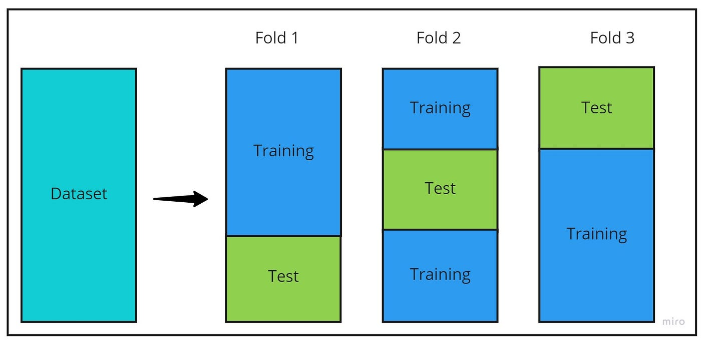

<h1 align="center">
  
   
  <!-- Estudo de Caso -->
</h1>

<!--  -->

[01 - Cross Validation](#1) 

## 01 - Cross Validation

    <a href="#topo">Voltar ao topo</a>

Validação cruzada, o número ideial é de 5 até 10.

* Adicionando aleatoriedade
    * K-fold : Embaralhando os dados `shuffle = True`;
    * StratifiedKFold : Para dados desbalanceados;
    * GroupKFold: Separa os dados por grupo;
    * Standard Scaler
    * Pipeline

***

    <a href="#topo">Voltar ao topo</a>

