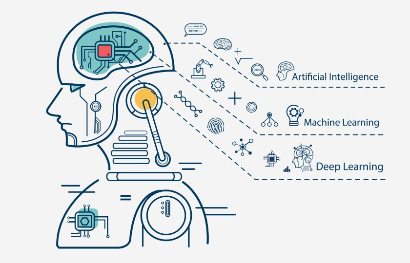

<h1 align="center">
  
   
  <!-- Estudo de Caso -->
</h1>

<!--  -->

📂 [01 - Classificação](#1) 
📂 [02 - Regressão](#2) 
📂 [03 - Imagem](#3) 
📂 [04 - NLP](#4) 
📂 [05 - Estatistica](#5) 
📂 [06 - Deep Learning](#6) 
📂 [07 - Recomendação](#7) 
📂 [08 - Plots](#8) 
📂 [09 - API](#9) 
📂 [10 - Otimização](#10) 

## 01 - Classificação

    <a href="#topo">Voltar ao topo</a>

- Técnicas
- Modelos

## 02 - Regressão

    <a href="#topo">Voltar ao topo</a>

- Técnicas
- Modelos

## 03 - Imagem

    <a href="#topo">Voltar ao topo</a>

- Técnicas
- Modelos

## 04 - NLP

    <a href="#topo">Voltar ao topo</a>

* Bag of Words
* Matriz Esparsa
* Word Cloud
* Tokenize
* Stop Words
* Stemmer
* TF-IDF
* Ngram
* Limpeza dos Dados

## 05 - Estatistica

    <a href="#topo">Voltar ao topo</a>

- Técnicas
  * Dicionário de Dados
  * Análise Exploratória
  * Tipo de Variáveis
  * Tabela de Frequência
  * Distribuição de Frequência
  * Medida de Tendência Central
    * Média
    * Mediana
    * Moda
  * Media Separatrizes
    * Quartis
    * Decis
    * Percentis
    * Box Plot
  * Medidas de Dispersão
    * Desvio Médio Absoluto
    * Variância
    * Desvio Padrão

## 06 - Deep Learning

    <a href="#topo">Voltar ao topo</a>

Exemplos de modelo de Deep Learning;

## 07 - Sistema de Recomendação

    <a href="#topo">Voltar ao topo</a>

Código de clustering;

## 08 - Plots

    <a href="#topo">Voltar ao topo</a>

Exemplos de gráficos.

## 09 - API

    <a href="#topo">Voltar ao topo</a>

Colocando o modelo em produção com o Flask, o modelo fica armazenado no Flask que recebe um json com os dados para o modelo prever e retorna uma lista com a predição.

## 10 - Otimização

    <a href="#topo">Voltar ao topo</a>

Técnicas para validar o modelo e encontrar os melhores pârametros para o modelo.

* Cross Validation
* K-fold
* StratifiedKFold
* GroupKFold
* GridSearchCV
* RandomSearch
* SMOTE

***

    <a href="#topo">Voltar ao topo</a>

